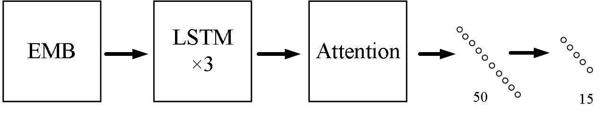
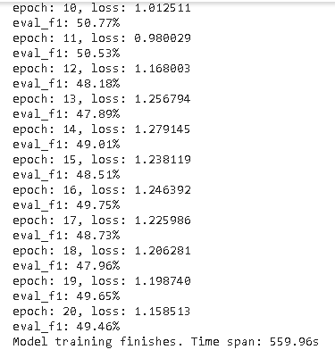
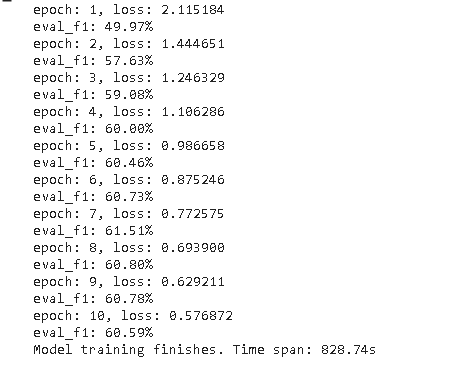

# NLP_NewsClassifier

## 模型设计

1. EMB：嵌入层，将输入的sentence转化为vector
2. LSTM：为了解决长序列训练过程中的梯度消失和梯度爆炸问题，采用三层LSTM网络
3. Attention层：为进一步解决长连接问题，引入Attention
4. 全连接层：第一层维度为 200 * 50，第二层维度为 50 * 15

## 实验结果

起初，我们设置学习率lr为0.005，可见loss忽高忽低，lr设置的过大，且f1值较低，考虑可能是欠拟合。

改进方式：设置学习率为0.002，LSTM层数增至3层（第一次为1层）

改进后，经过5轮，fi值提升至60%以上，虽然之后loss仍在下降，但是f1值未变，存在过拟合现象。

测试样例：

