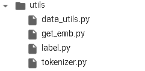

# 代码说明文档

文件目录:

 

Tnews_MultiClassCorp.py用于读取数据集，并封装了三个函数用于读取训练集，验证集和测试集。

 
 

Models中的各个 py文件为分装好的模型，本项目采用的是LSTMAttentionClassifier

  

主要有LSTM层，Attention层，和全连接输出层

  
 
Forward 函数定义了前向传播的算法

   

Utils 中为一些工具类，data_utils用于读取数据集， get_emb 和tokenizer加载词表， label提供了加载标签，以及标签id和id具体描述转换的方法。

   

素材中为本次项目所用的词表

   

主文件为TNEWS_Classification.ipynb
具体功能如下：

本实验在云端调试，需要mount 云盘，需要加上云盘路径
 

设定超参数

加载数据，返回值为词向量矩阵，训练集和验证集和tokenizer

加载模型

训练模型函数，每一次轮训练后，都会存储一次模型，并利用验证集的计算结果计算F1值。
 

Tensor_to_label函数将输出的logits 求最大的一个logit 对应的label_desc。
 

Test 函数可以调用模型，根据输入的字符串输出相应的分类结果。

类实例化，初始化加载数据集和模型

训练模型
 

该部分是为了满足测试网站要求的测试文件格式，编写的生成相应文件的代码。主要功能是调用测试集，并根据词表转换成vector 作为模型输入，再将生成的结果转换成label id，最后将结果写入文件。
 
