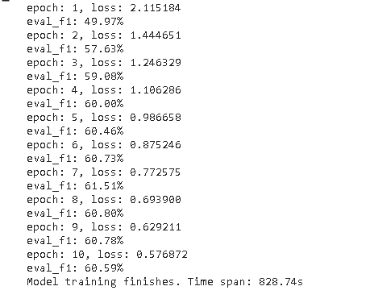

# 文本分类报告

==摘要、关键词==

## 1. 文献综述

文本分类是指在预先给定的类别标记（label）集合下，根据文本内容判定它的类别。文本分类传统分为三个步骤，即文本的向量模型表示、文本特征的选择和分类器训练。随着深度学习的发展，特征提取、选择和文本分类的任务都可以通过深度学习训练模型实现，无需人工分别指定算法。

### 1.1 分词

#### 1.1.1 背景概述

与大多数印欧语系的语种不同，汉语的字词之间没有空格，古代汉语中词通常是单个汉字，但现代汉语中多为双字或多字词，且词和词组没有明晰的边界，而句子则是以字串的形式出现。因此对中文进行处理的第一步就是进行分词，将字串转变成词串。

中文分词是处理中文的语义分析，文本分类，文本挖掘，信息检索，机器翻译，语音合成，自动分类，自动摘要，自动校对等问题的基础。中文分词的方法也被应用到英文处理，如手写识别，中文分词方法可以帮助判别英文单词的边界。因此如果分词效果不好，很有可能会严重影响到后续的研究。 
 因为中文存在交集歧义，组合歧义，无法在句子中解决的歧义，具有未登录词等特征，使得中文分词很难。

中文[分词技术](http://baike.baidu.com/view/2699566.htm)属于[自然语言处理](http://baike.baidu.com/view/18784.htm)技术范畴，对于一句话，人可以通过自己的知识来明白哪些是词，哪些不是词，但如何让计算机也能理解？其处理过程就是分词算法。

#### 1.1.2 分词算法

现有的分词算法可分为三大类：基于匹配得词典的分词方法、基于统计的机器学习分词方法和基于理解的深度学习分词方法。按照是否与词性标注过程相结合，又可以分为单纯分词方法和分词与标注相结合的一体化方法。

#### **1.1.2.1 基于匹配的词典分词**

这种方法又叫做机械分词，它按照一定策略将待分析的汉字串与一个“充分大的”机器词典中的词条进行匹配，若在词典中找到某个字符串，则匹配成功。该方法有三个要素，即分词词典、文本扫描顺序和匹配原则。根据扫描方向的不同可分为正向匹配和逆向匹配。根据不同长度优先匹配的情况，分为最大（最长）匹配，最小（最短）匹配和逐词匹配。根据与词性标注过程是否相结合，又可以分为单纯分词方法和分词与标注相结合的一体化方法。常用的几种机械分词方法如下：

最大匹配法（MM）是在词典中按词频的大小顺序排列词条，以求缩短对分词词典的检索时间，降低分词的时间复杂度，加快分词速度。其主要原理都是切分出单字串，然后和词库进行比对，如果是一个词就记录下来， 否则通过增加或者减少一个单字，继续比较，一直还剩下一个单字则终止，如果该单字串无法切分，则作为未登录处理。问题是要做到最大匹配，并不是第一次匹配到就可以切分的，最大匹配出的词必须保证下一个扫描不是词表中的词或词的前缀才可以结束。这类方法简单、分词效率较高,但汉语语言现象复杂丰富，词典的完备性、规则的一致性等问题使其难以适应开放的大规模文本的分词处理。

##### **最大正向匹配法（由左到右的方向）**

假设自动分词词典中的最长词条所含汉字的个数为i，则用被处理文档当前字符串序列中的前i个字符作为匹配字段，查找分词词典，若词典中有这样一个i字词，则匹配成功，匹配字段作为一个词被切分出来；若词典中找不到这样的一个i字词，则匹配失败，匹配字段去掉最后一个汉字，对剩下的字串重新进行匹配处理，直到匹配成功为止。统计结果表明，该方法的错误率为 1/169。

##### **逆向最大匹配法RMM（由右到左的方向）**

该方法的基本原理与ＭＭ法相同，不同的是分词切分的方向与MM法相反，而且使用的分词词典也不同（逆序词典），每次匹配不成功时去掉的是前面的一个汉字。

由于汉语中偏正结构较多，若从后向前匹配，可以适当提高精确度。所以，逆向最大匹配法比正向最大匹配法的误差要小。统计结果表明，单纯使用逆向最大匹配的错误率为 1/245。当然，最大匹配算法是一种基于分词词典的机械分词法，不能根据文档上下文的语义特征来切分词语，对词典的依赖性较大，所以在实际使用时，难免会造成一些分词错误，为了提高系统分词的准确度，可以采用正向最大匹配法和逆向最大匹配法相结合的分词方案。

##### **双向最大匹配法（进行由左到右、由右到左两次扫描）**

将正向最大匹配法与逆向最大匹配法组合。先根据标点对文档进行粗切分，把文档分解成若干个句子，然后再对这些句子用正向最大匹配法和逆向最大匹配法进行扫描切分。如果两种分词方法得到的匹配结果相同，则认为分词正确，否则，按最小集处理。

##### **全切分法**

部分切分只用一种或几种可接受的切分形式，由于忽略了可能的其他切分形式，所以建立在部分切分基础上的分词方法不管采取何种歧义纠正策略，都可能会遗漏正确的切分，造成分词错误或失败。而建立在全切分基础上的分词方法，由于取得了所有可能的切分形式，因而从根本上避免了可能切分形式的遗漏，克服了部分切分方法的缺陷。

全切分算法能取得所有可能的切分形式，它的句子覆盖率和分词覆盖率均为100%，但全切分分词并没有在文本处理中广泛地采用，原因有以下几点：

1)全切分算法只是能获得正确分词的前提，因为全切分不具有歧义检测功能，最终分词结果的正确性和完全性依赖于独立的歧义处理方法，如果评测有误，也会造成错误的结果。

2)全切分的切分结果个数随句子长度的增长呈指数增长，一方面将导致庞大的无用数据充斥于存储数据库；另一方面当句长达到一定长度后，由于切分形式过多,造成分词效率严重下降。

实际使用的分词系统，都是把机械分词作为一种初分手段，还需通过利用各种其它的语言信息来进一步提高切分的准确率。

一种方法是改进[扫描方式](http://baike.baidu.com/view/115274.htm)，称为特征扫描或标志切分，优先在待分析字符串中识别和切分出一些带有明显特征的词，以这些词作为[断点](http://baike.baidu.com/view/278359.htm)，可将原字符串分为较小的串再来进机械分词，从而减少匹配的错误率。比如设立切分标志法，切分标志有自然和非自然之分。自然切分标志是指文章中出现的非文字符号，如标点符号等；非自然标志是利用词缀和不构成词的词（包括单音词、复音节词以及象声词等）。设立切分标志法首先收集众多的切分标志，分词时先找出切分标志，把句子切分为一些较短的字段，再用 MM、RMM 或其它的方法进行细加工。这种方法并非真正意义上的分词方法，只是自动分词的一种前处理方式而已，它要额外消耗时间扫描切分标志，增加存储空间存放那些非自然切分标志。

另一种方法是将分词和词类标注结合起来，利用丰富的词类信息对分词决策提供帮助，并且在标注过程中又反过来对分词结果进行检验、调整，从而极大地提高切分的准确率。

#### **1.1.2.2 基于统计的机器学习分词方法**

从形式上看，词是稳定的字的组合，因此在上下文中，相邻的字同时出现的次数越多，就越有可能构成一个词。因此字与字相邻共现的频率或概率能够较好的反映成词的可信度。对语料中相邻共现的各个字的组合的频度进行统计，可以计算它们的互现信息。互现信息体现了汉字之间结合关系的紧密程度。当紧密程度高于某一个阈值时，便可认为此字组可能构成了一个词。首先给出大量已经分词的文本，利用统计[机器学习](http://baike.baidu.com/view/7956.htm)模型学习词语切分的规律（即训练），从而实现对未知文本的切分，只需对语料中的字组频度进行统计，不需要切分词典，因而又叫做无词典分词法或统计取词方法。

但这种方法也有一定的局限性，最大缺点是需要有大量预先分好词的语料作支撑，而且训练过程中时空开销极大，会经常抽出一些共现频度高但无意义的字组，如“是的”，“我的”，并且对常用词的识别精度差。实际应用的统计分词系统都要使用一部基本的分词词典（常用词词典）进行串匹配分词，同时使用统计方法识别一些新词，即将串频统计和串匹配结合起来，既发挥匹配分词切分速度快、效率高的特点，又利用了无词典分词结合上下文识别生词、自动消除歧义的优点。

该方法常用的统计模型有：N 元文法模型（N-gram）、隐马尔可夫模型（Hiden Markov Model，HMM）、最大熵模型（ME）、条件随机场模型（Conditional Random Fields，CRF）等。

##### **隐马尔科夫模型**（HMM）

隐马尔可夫模型应用非常广泛，基本思想就是根据观测值序列找到真正的隐藏状态值序列。在中文分词中，一段文字的每个字符可以看作是一个观测值，而这个字符的词位置label（BEMS）可以看作是隐藏的状态。使用HMM的分词，通过对切分语料库进行统计，可以得到模型中5大要要素：起始概率矩阵，转移概率矩阵，发射概率矩阵，观察值集合，状态值集合。有了三个矩阵和两个集合后，HMM问题最终转化成求解隐藏状态序列最大值的问题。但该方法得一个缺点就是由于其输出独立性假设，导致其不能考虑上下文的特征，限制了特征的选择，不能选择复杂的特征。

##### **最大熵马尔可夫模型（MEMM）**

最大熵马尔可夫模型是把隐马尔可夫模型和最大熵模型的优点集合成一个产生式模型，这个模型允许状态转移概率依赖于序列中彼此之间非独立的特征上，从而将上下文信息引入到模型的学习和识别过程中，提高了识别的精确度，召回率也大大的提高，最大熵隐马尔可夫模型则解决了隐马尔可夫的问题，可以任意选择特征，但由于其在每一节点都要进行归一化，所以只能找到局部的最优值，同时也带来了标记偏见的问题，即凡是训练语料中未出现的情况全都忽略掉。

##### **条件随机场模型（CRF）**

条件随机场模型是用来标注和划分结构数据的概率化结构模型。和HMM类似，当对于给定的输入观测序列X和输出序列Y，通过定义条件概率P(Y|X)，而不是联合概率分布P(X，Y)来描述模型。运用在分词中的基本思路是对汉字进行标注即由字构词（组词），不仅考虑了文字词语出现的频率信息，同时考虑上下文语境，具备较好的学习能力，因此对歧义词和未登录词的识别都具有良好的效果。其不足之处是训练周期较长，运营时计算量较大，性能不如词典统计分词。

##### **N元文法模型（N-gram）**

N-gram模型认为第n个词的出现只与前面的n-1个词有关，整句的概率就是各个词出现概率的乘积。N-gram模型利用上下文相邻词间的相关信息，选择具有最大出现概率的词语组合，实现自动分词，该模型具有语种无关性，拼写错误兼容能力强，能较好处理中英文及繁简体文本，是中文信息处理常用的语言模型。

基于统计的分词方法可以识别出频率较高的未登录词，还很好解决了新词出现的问题，这是机械分词无法做到的。但是人工特征选择是影响传统机器学习方法分词结果的重要因素。近年，基于深度学习的中文分词方法无需人工选择特征，且有较高的分词准确率，对中文分词算法的进一步发展产生了巨大影响。

#### **1.1.2.3 基于理解的深度学习分词方法**

这种分词方法是通过让计算机模拟人对句子的理解，达到识别词的效果。其基本思想就是在分词的同时进行句法、[语义分析](http://baike.baidu.com/view/487035.htm)，利用句法信息和语义信息来处理歧义现象。它通常包括三个部分：分词子系统、句法语义子系统、总控部分。在总控部分的协调下，分词子系统可以获得有关词、句子等的句法和语义信息来对分词歧义进行判断。这种分词方法需要使用大量的语言知识和信息。由于汉语语言知识的笼统、复杂性，难以将各种语言信息组织成机器可直接读取的形式，因此目前基于理解的分词系统还处在试验阶段。

##### **专家系统分词法**

分词专家系统能充分利用词法知识、句法知识、语义知识和语用知识进行逻辑推理，实现对歧义字段的有效切分。从专家系统角度把分词的知识从实现分词过程的推理机中独立出来，使知识库的维护与推理机的实现互不干扰，从而使知识库易于维护和管理。

##### **神经网络分词法**

该方法是模拟人脑并行，分布处理和建立数值计算模型工作的。它将分词知识所分散隐式的方法存入神经网络内部，通过自学习和训练修改内部权值，以达到正确的分词结果，最后给出神经网络自动分词结果，如使用 LSTM、GRU 等神经网络模型等。

##### **神经网络专家系统集成式分词法**

该方法首先启动神经网络进行分词，当神经网络对新出现的词不能给出准确切分时，激活专家系统进行分析判断，依据知识库进行推理，得出初步分析，并启动学习机制对神经网络进行训练。该方法可以较充分发挥神经网络与专家系统二者优势，进一步提高分词效率。

奉国和表示采用神经网络与专家系统的深度学习分词算法与其他方法相比具有如下特点: ①知识的处理机制为动态演化过程; ②字词或抽象概念与输入方式对应，切分方式与输出模型对应; ③能较好地适应不断变化的语言现象，包括结构的自组织和词语的自学习; ④新知识的增加对系统处理速度影响不大， 这与一般机械匹配式分词方法有很大区别; ⑤有助于利用句法信息和语义信息来处理歧义现象， 提高理解分词的效果。

唐琳等通过统计发现近三年深度学习、LSTM、双向LSTM和注意力机制是中文分词研究的主流方法。而结合不同算法优势解决具体中文分词问题是未来探索的方向。

### 1.1.3 分词难点

有了成熟的分词算法，是否就能容易的解决中文分词的问题呢？事实远非如此。中文是一种十分复杂的语言，让计算机理解中文语言更是困难。在中文分词过程中，有两大难题一直没有完全突破。

#### **1.1.3.1 歧义识别**

歧义是指同样的一句话，可能有两种或者更多的切分方法。主要的歧义有两种：交集型切分歧义（Overlapping Ambiguity Segmentation，OAS）和多义组合型切分歧义（Combination Ambiguity Segmentation，CAS），交集型切分歧义也称为交叉歧义，例如：“化妆和服装”可以分为“化妆”“和” “服装”，也可以分成“化妆”“和服”“装”。交叉歧义十分常见，由于没有人的知识去理解，计算机很难知道到底哪个方案正确。多义组合型切分歧义也称为覆盖歧义，例如：“李刚是很有才能的人”中“才”、“能”本身都可以单独构词，也可以合并为“才能”构词。

交集型歧义相对组合型歧义来说是更容易处理，因为组合型歧义必须根据整个句子来判断。例如，在句子“这个门把手坏了”中，“把手”是个词，但在句子“请把手拿开”中，“把手”就不是一个词；在句子“将军任命了一名中将”中，“中将”是个词，但在句子“产量三年中将增长两倍”中，“中将”就不再是词。这些词计算机又如何去识别?

从另一种分类角度出发，在歧义中还有一个难题，即真歧义。真歧义是中文文本本身的语法和语义都没有问题，即便人工进行切分也会产生歧义。例如：“乒乓球拍卖完了”，可以切分成“乒乓 球拍 卖 完 了”、也可切分成“乒乓球 拍卖 完 了”，如果没有上下文其他的句子，即便是人也很难区分“拍卖”在这里算不算一个词。

#### 1.1.3.2 未登录词识别

未登录词识别包括新涌现的通用词、专业术语和专有名词，如中国人名、外国译名、地名、机构名（泛指机关、团体和其他企事业单位）等。其中，人名、地名和机构名具有多变性，处理难度较大。最典型的是人名，句子“王军虎去广州了”中，“王军虎”是个词，因为是一个人字，人很容易理解，但让计算机识别出来就非常就困难。如果把“王军虎”作为一个词收录到字典中，全世界有那么多名字，而且每时每刻都有新增的人名，收录这些人名本身就是一项既不划算又巨大的工程。即使这项工作可以完成，还是会存在问题，例如：在句子“王军虎头虎脑”中，“王军虎”还能不能算词？

因此，在1995年11月的第6届MUC会议（MUC-6）上，提出了一个明确的概念——命名实体（Named Entity，NE），包括人名、地名、机构名、日期、时间、百分数和货币。事件抽取任务、知识图谱、信息检索、问答系统等都十分依赖命名实体识别。因此，命名实体识别被单独研究。

 

### 1.2 文本表示

#### 1.2.1 引言

文本表示是指将自然语言的符号表示转换成计算机能够处理的数学形式——向量。因此如何将字符串转化为向量，就是文本表示的核心问题。近年来，基于深度学习的神经网络文本表示学习方法成为研究热点，目前基于深度学习的文本表示研究主要集中在两个方面：①如何通过神经网络模型学习到一个好的词向量表示，②如何基于已有的词表示建立更大粒度（短语、句子、段落、篇章）的文本表示模型，更好的完成自然语言处理任务。

#### 1.2.2 传统的文本表示方法

##### one-hot表示

在一个语料库中，给每个字/词编码一个索引，根据索引进行one-hot表示。词语被表示成一个维度为词表大小的向量，这个向量中只有一个维度是1其他位置都是0。one-hot简单易用，但是缺点也十分明显：

1)    当语料库非常大时，就需要建立一个很大的字典对所有单词进行索引编码。比如100W个单词，每个单词就需要表示成100W维的向量，同时每个向量只有一位为1，其他全为0。浪费了大量的存储空间。

2)    one-hot表示出的两个向量是正交向量，因此无法表达单词与单词之间的相似程度。

##### TF-IDF

TF-IDF（term frequency–inverse document frequency，词频-逆向文件频率） 是一种用来计算每个单词重要性的关键词抽取的方法。TF-IDF是一种统计方法，用以评估字词对于一个文件集或一个语料库中的其中一份文件的重要程度。字词的重要性与其在文件中出现次数成正比，但同时与它在语料库中出现的频率成反比。

1)    TF是词语频率（Term Frequency），表示词条（关键字）在文本中出现的频率。

TF(t)=该词条在当前文档出现的次数 / 当前文档中词条的总数

2)    IDF是逆文档频率（Inverse Document Frequency）。如果包含某词条的文档越少, IDF越大，则说明该词条具有很好的类别区分能力。

IDF(t)= log（文档总数 / 出现该词条的文档总数）

TF-IDF算法的优点是简单快速，结果比较符合实际情况。缺点也十分明显：单纯以"词频"衡量一个词的重要性不够全面，有时重要的词可能出现次数并不多；无法体现词的位置信息，出现位置靠前的词与出现位置靠后的词，都被视为重要性相同。

#### 1.2.3 词的分布式表示方法

为了解决one-hot词表示方法无法反映词语之间语义相似性的问题，1954 年，Harris提出分布假说（distributional hypothesis）：“上下文相似的词，其语义也相似”。1957 年，Firth完善了这一假说，指出“词的语义由其上下文决定”。词的分布式表示是一种维度大小相对较低的稠密向量表示，且每一个维度都是实数。分布式表示将所有信息分布式的表示在稠密向量的各个维度上，其表示能力更强，且具备了不同程度上语义表示的能力。分布式表示方法要做的就是利用上下文信息把每一个词映射成一个维度固定的短向量，这样在它们所构成的向量空间中，每个词都是一个点，就可以通过距离来判断语义的相似度。

##### NNLM

Bengio等人在2003年提出了NNLM模型，NNLM是从语言模型出发(即计算概率角度)，构建神经网络针对目标函数对模型进行最优化，训练的起点是使用神经网络去搭建语言模型实现词的预测任务，并且在优化过程后模型的副产品就是词向量。

优点：NNLM 使用稠密向量作为单词的词嵌入表示，解决了简单词嵌入表示如 TF-IDF 的向量稀疏等问题。使用NNLM模型生成的词向量可以自定义维度，生成的词向量能够很好的根据特征距离度量词与词之间的相似性。

缺点：计算复杂度过大，参数较多

##### Word2vec

2013年由谷歌团队推出的一款工具包，至今仍被广泛使用。它是基于神经网络模型对词嵌入的实现。其中包含了CBOW和Skip-gram两个语言模型：前者是根据上下文预测中心词，后者是利用中心词预测上下文。以及两种近似训练法：负采样（negative sampling）和层序softmax（hierarchical softmax）。和 NNLM 顺便得到词嵌入表示的方法不一样，学习每个单词的词嵌入表示是 Word2Vec 的主要任务。

优点：由于Word2vec会考虑上下文，因此和NNLM相比效果更好；与NNLM相比维度更少，速度更快；通用性很强，可用在各种NLP任务中

缺点：词嵌入向量表示与单词是一对一的关系，一词多义问题还是没有解决；Word2vec 是一种静态的方式，虽然通用性强，但是无法针对特定任务做动态优化

##### Glove

2014年，Pennington 等人针对词向量Word2Vec训练模型没有考虑词序，没有考虑文本全局的统计信息的不足，提出全局词--词共现矩阵，得到一种新的词向量Glove。核心思想就是挖掘词语共现信息的内在含义，融合基于全局统计的方法（如LSI/LSA等）和基于局部预测方法（如word2vec等）于一体，可以加快模型的训练速度，又可以控制词的相对权重。在词聚类任务上的效果超越了word2vec。

但是Omer Levy等人对基于计数的方法和基于词嵌入的方法做了对比，发现它们之间并没有非常大的差距，在不同的场景各个模型发挥不同的作用，它们之间并没有谁一定优于谁，相比于算法而言，增加语料量，进行预处理以及超参数的调整显得非常重要。

##### Fasttext

2016年，Joulin 等人将局部词序n-gram特征（子词）融入到神经网络模型中，训练出一种新的词向量 fasttext 用于文本分类，模型不仅训练速度极快，而且能学习到训练语料中未出现的未登录词。

[fasttext](https://link.zhihu.com/?target=https%3A//arxiv.org/pdf/1607.01759.pdf)的模型与CBOW类似。CBOW预测上下文的中间词，fasttext预测文本标签。与word2vec算法的衍生物相同，稠密词向量也是在训练神经网络的过程中得到的。fasttext的输入是一段词的序列，即一篇文章或一句话，输出是这段词序列属于某个类别的概率，所以fasttext通常用来做文本分类。

##### ELMo (Embeddings from Language Models)

2018 年，Peters 等人首次提出了 ELMo 模型。与静态的词嵌入表示得到固定向量表示不一样，ELMo 首先通过语言模型进行学习，得到单词的一个词嵌入表示，在实际使用词嵌入时，根据上下文单词的语义再去调整单词的词嵌入表示，从而使得单词在不同的上下文语境中得到不同的词嵌入表示。

优点：能够处理单词用法中的复杂特性（比如句法和语义），可以根据不同的语境改变单词语义，能解决一词多义的问题；词向量表示是基于字符的，考虑了单词的形态特征，能处理预料中的未登录词，泛化能力更强。

缺点：速度较慢；语言本身形态不丰富的话（如中文），ELMo优势不明显；如果训练数据很少，和word2vec相比差别不大。

### 1.3 降维和分类算法

目前的中文信息处理技术一般都基于字/词向量，但是长文本进行向量表示后存在维数过高的问题，会导致运算时间和空间复杂度陡然上升，并且很多机器学习模型不支持过高维数的向量处理，因此我们需要对数据进行降维，而特征选择和抽取就是力求在不损伤分类性能的同时达到降维的目的。

生成特征向量的过程就是特征提取，由于特征提取中的基本元素是词条，特征维数爆炸且噪声多。因此需要通过特征约简删除提取后的文本向量中对文本分类没有显著贡献的特征项。而如何进行判断哪些特征项对文本分类没有影响，主要分为基于统计和基于语义两种方式。而特征抽取则是由原始的低级特征(比如词) 经过某种变换构建正交空间中的新特征的方法。合理的降维方法会使多数分类器都呈现出虽特征数量增加，效果快速提高并能迅速接近平稳

#### 1.3.1  特征选择

特征选择通常分为基于统计和基于语义两种方式。

##### 1.3.1.1 基于统计的特征选择

基于统计（阈值）的统计方法计算复杂度低、速度快。根据待处理文本间关系主要分为平面文本分类和等级文本分类。

###### 1.3.1.1.1  平面文本分类算法

主要分为文档频率方法（DF）、信息增益方法（IG）、互信息方法（MI）、CHI方法

(1)  文档频率方法即是特征t 在文本集中出现的文档数。

(2)  信息增益方法。在决策树算法的学习过程中，信息增益是特征选择的一个重要指标，它定义为一个特征能够为分类系统带来多少信息，带来的信息越多，说明该特征越重要，相应的信息增益也就越大。

(3)  互信息用来评价一个事件的出现对于另一个事件的出现所贡献的信息量。使用互信息理论进行特征抽取是基于如下假设:在某个特定类别出现频率高,但在其他类别出现频率比较低的词条与该类的互信息比较大。通常用互信息作为特征词和类别之问的测度，如果特征词属于该类的话，它们的互信息量最大。由于该方法不需要对特征词和类别之问关系的性质作任何假设，因此非常适合于文本分类的特征和类别的配准工作。互信息计算的时间复杂度类似于信息增益,互信息的平均值就是信息增益。互信息的不足之处在于得分非常受词条边缘概率的影响。

(4)  卡方检验最基本的思想就是通过观察实际值与理论值的偏差来确定理论的正确与否。在文本分类的特征选择阶段，一般使用“词t与类别c不相关”来做原假设，计算出的开方值越大，说明对原假设的偏离越大，我们越倾向于认为原假设的反面情况是正确的。选择的过程为每个词计算它与类别c的开方值，从大到小排个序（此时开方值越大越相关），取前k个就可以。

其中A 是特征t 和第i 类文档共同出现的次数,B 是特征t 出现而第i 类文档不出现的次数, C 是第i 类文档出现而特征t 不出现的次数,D 是第i 类文档和特征t 都不出现的次数。

###### 1.3.1.1.2  等级文本分类

主要分为期望交叉熵、文本证据权

(1)  期望交叉熵也称为KL距离，反映的是文本类别的概率分布和在出现了某个特征的条件下文本类别的概率分布之间的距离。与信息增益相比，期望交叉熵不再考虑特征项不出现的情况，这就大大降低了一些出现次数很少的稀有特征的干扰，提高了分类的效率。但只考虑了特征与类别之间的相关性，而忽略了特征项在类内和类间分布的均匀程度。

(2)  文本证据权

其中P(C｜T)表示文本中出现词条T时，文本属于类别C的概率，P(C)是类别出现的概率。文本证据权比较了类出现的概率和在给定特征下类出现的条件概率之间的差别。如果词条和类别强相关（P(C｜T)大)，并且相应类别出现的概率小，说明这时词条对分类的影响大，计算出的函数值就大，可选取作为特征项。

##### 1.3.1.2  基于语义的特征选择

(1)  基于语境框架的文本特征提取方法：将语义分析融入统计算法，基本方法仍是“统计-抽取”

(2)  基于本体论的文本特征提取方法：应用本体论(On-tology)模型可以有效地解决特定领域知识的描述问题。

(3)  基于知网的概念特征提取方法：基于概念特征的特征提取方法是在VSM的基础上,对文本进行部分语义分析,利用知网获取词汇的语义信息,将语义相同的词汇映射到同一概念,进行概念聚类,并将概念相同的词合并成同一词

#### 1.3.2 特征抽取

特征抽取的方法主要有主成分分析（PCA）、线性判别分析法（LDA）、独立成分分析法( ICA )。 

(1)  主成分分析的基本思想是从一组特征中计算出一组按照重要性的大小从大到小依次排列的新特征，它们是原有特征的线性组合，并且新特征之间不相关, 我们计算出原有特征在新特征上的映射值即为新的降维后的样本。也就是说PCA的目标是用一组正交向量来对原特征进行变换得到新特征，新特征是原有特征的线性组合。

(2)  线性判别分析法的原理是将带上标签的数据（点），通过投影的方法，投影到维度更低的空间中，使得投影后的点，会形成按类别区分，一簇一簇的情况，相同类别的点，将会在投影后的空间中更接近。使用这种方法能够使投影后模式样本的类间散布矩阵最大，并且同时类内散布矩阵最小。即模式在该空间中有最佳的可分离性。

(3)  独立成分分析的基本原理是通过分析多维观测数据间的高阶统计相关性，找出相互独立的隐含信息成分，完成分量间高阶冗余的去除及独立信源的提取。

#### 1.3.3 分类算法

各种分类算法的目标是提高分类效果、可扩展性和分类过程的吞吐率（速度）。而常用的效果评估的指标有正确率、召回率、均衡点、F1和精度、宏平均、微平均。根据不同的分类思想主要可以分为相似度模型、概率模型、线性模型、非线性模型和多分类器集成学习（emsemble learning）。

##### 1.3.3.1 相似度模型

计算文档相似度也有两类方法，一种是计算文档与代表某一文档类别的中心向量之间的相似度，距离的计算方式有词条重复率、向量夹角、欧几里得距离等。另一种则是计算找出训练集与测试文本距离最近的k个文本，根据这k个文本的类别判定新文本类别，代表性的算法是K-邻近算法

##### 1.3.3.2 概率模型

概率模型最常用的是朴素贝叶斯模型，它通过特征词的先验概率计算该文本属于每一个类别的后验概率。学者们基于朴素贝叶斯进行算法改进，产生了增强型朴素贝叶斯算法、与潜在语义索引结合的贝叶斯方法、贝叶斯层次分类等进阶算法。

##### 1.3.3.3 线性模型

线性模型在文本分类中较为常用，最广为采用的是支持向量机(SVM)算法，它基于的假设是基于假设是文章中词条出现的顺序无关紧要，对于文档的类别所起的作用是相互独立的，因此可以讲文档看作一系列无序词条的集合。SVM在给定训练集上，作一个超平面的线性划分，将分类问题转化成一个寻找空间最优平面的问题，其中最优超平面能够正确划分所有向量，且各类向量与超平面的最小距离最大化。它的优点在于克服了样本分布、冗余特征以及过拟合等因素的影响，具有很好地泛化能力。但仍存在一些问题，如(1)在大数据集上的训练收敛速度较慢，需要大量的存储资源和很高的计算能力；(2)没有考虑文本的上下文间的语义关系和潜在的概念结构，如共现关系、同义关系等(3)向量空间模型基于各个分量正交的假设在现实中不成立，分词词条往往具有较强相关性。

线性最小二乘拟合方法(LLSF)则是另一种线性模型，算法思想是经过预处理的文档为一个|n|维的输入向量I(dj)，分类结果表示成一个|C|维(训练文档预先被分成|C|类)的输出向量O(dj)，就将分类问题转换成找到矩阵M，使得MI(dj)=O(dj)的问题。

##### 1.3.3.4 非线性模型

非线性模型主要分为两类，层次模型和网络模型。决策树是代表性的层次模型，从具有最大信息增益的属性开始，对测试属性的每个已知的值，创建一个分支，直至需要分类的岩本测试完所有的属性，可选的算法有ID3、C4.5、C5等。神经网络是代表性的网络模型，一组连接的输入输出单元，输入单元是词条，输出单元是文本归属值，单元之间的连接都有相应的权值

##### 1.3.3.5 多分类器集成学习（emsemble learning）

通过组合多个分类器来解决同一个问题,可以获得比仅仅使用单一分类器更好的性能。主要分为两种类型，决策优化和覆盖优化。决策优化是对不同分类器采用完整样本集进行训练，在对所有分类器的决策进行投票或评价，如MV、WMV、WLC。而覆盖优化则是对同一种学习采用不同的训练子集，形成参数不同的单分类器，在对单分类器进行综合，如Bagging和Boosting。

### 1.4 深度学习模型

深度学习出现后，文本分类任务中本来需要人工选择算法的特征提取部分也可以由机器自动学习完成，然后通过softmax函数预测分类。这一部分就介绍几个代表性的模型，以及模型间效果的比较。

#### 1.4.1 TextCNN模型

CNN是深度学习中常用于处理图像的模型，特点是可以对数据降维，同时保留图像的特征。Yoon Kim^1^在论文中将CNN用于句子分类，其原理如下：

该模型的核心是将文本看作图片。首先使用word2vec完成词嵌入，假设数据集中的句子最长长度为$n$，词嵌入维度为$k$，那么每个句子用$n \times k$的矩阵来表示，作为分类任务的输入。

在卷积层，使用大小不同的过滤器提取特征，然后融合。每次卷积操作使用一个窗口大小为$h$个词的过滤器$\mathbf{w} \in \mathbb{R}^{h k}$，可以提取一个特征。某一特征$c_i$的提取表示如下：
$$
c_{i}=f\left(\mathbf{w} \cdot  \mathbf{x}_{i: i+h-1}+b\right)
$$
其中，$b$是偏置量，$f$为非线性激活函数。该过滤器在句子$\left\{\mathrm{x}_{1: h}, \mathrm{x}_{2: h+1}, \ldots, \mathrm{x}_{n-h+1: n}\right\}$上移动，生成特征地图：
$$
\mathbf{c}=\left[c_{1}, c_{2}, \ldots, c_{n-h+1}\right], \mathbf{c} \in \mathbb{R}^{n-h+1}
$$
随后在池化层留下每个特征地图的最大值，进入全连接层，输出对应每个标签的分布概率。

另外，该模型设置了两个词向量“通道”，其中一个在训练过程中保持不变，另一个在反向传播的过程中微调。双通道模型（CNN-multichannel）希望用于防止过拟合，但是效果并不明显。词向量保持不变的单通道模型（CNN-static）和微调词向量的模型（CNN-non-static）在多个任务中都优于当时的其他模型，并且后者比前者得分更高。

但是，该模型也有不足之处：CNN无法处理序列数据，不能将更大范围内的上下文纳入考虑。

#### 1.4.2 使用LSTM方法的模型

RNN的提出解决了序列数据的问题，可以记住上下文中的信息，但是存在梯度爆炸和消失问题，也难以处理长期依赖。Hochreiter和Schmidhuber^2^提出的 Long Short-Term Memory networks (LSTM) 是一种特殊的RNN，可以记忆更长范围内的内容，在自然语言处理方面就体现在可以考虑更远的上下文中的单词。

使用LSTM完成文本分类任务也有不同的模型，蓝雯飞^3^等人指出，第一种是把LSTM最后时刻的输出作为下一层的输入，然后在softmax层进行全连接操作，得到预测分类的分布概率；第二种是把所有时刻的LSTM单元输出加和求平均后的结果作为更高级的文本表示向量，之后的操作与前者相同。

也可以使用Bi-LSTM（Bidirectional LSTM）模型^4^，第一层从左边作为系列的起始输入，在文本处理上可以理解成从句子的开头开始输入，而第二层则是从右边作为系列的起始输入，在文本处理上可以理解成从句子的最后一个词语作为输入，最后对得到的两个结果进行处理。在文本分类任务上表现比普通LSTM要更好。Bi-LSTM模型的结构如下：

另外，也有论文使用GRU模型完成文本分类任务^5^。2017年，《LSTM Recurrent Neural Networks for Short Text and Sentiment Classification》一文中的实验结果如下（其中的LSTM方法使用的是上文中提到的第一种LSTM模型）：

#### 1.4.3 LSTM-Attention模型和AC-BiLSTM模型

注意力机制（Attention）最早是在图像领域提出来的。在自然语言处理领域，最早是在机器翻译上应用注意力机制，翻译效果有显著提高。

上一部分中提到的两种使用LSTM做文本分类任务的模型，第一种缺失了前面的输出信息，第二种求平均则没有体现每个时刻输出信息的不同重要程度。为了解决这类问题，蓝雯飞等人^3^将Attention机制引入LSTM模型，设计出了LSTM-Attention模型，结构如下：

图中输入序列为一段文本分词后的各个词的向量表示$x_{0}, x_{1}, x_{2}, \cdots, x_{i}$，将每个输入传入LSTM 单元，得到对应隐藏层的输出$h_{0}, h_{1}, h_{2}, \cdots, h_{i}$。这里，在隐藏层引入Attention，计算各个输入分配的注意力概率分布值$\alpha_{0}, \alpha_{1}, \alpha_{2}, \cdots, \alpha_{i}$，$\alpha_{i}, j \in[0, t]$的计算公式如下：
$$
\alpha_{i}=\frac{\exp \left(\operatorname{score}\left(\bar{h}, h_{i}\right)\right)}{\sum_{j} \exp \left(\operatorname{score}\left(\bar{h}, h_{j}\right)\right)}
$$
其中，$\bar{h}$是比词更高一级的文本表示向量，这里没有采用上文提到的两种表示方法，而是随机初始化，作为一个参数在训练中逐步更新。${score}\left(\bar{h}, h_{i}\right)$表示第$i$个隐藏层输出$h_{i}$在文本表示向量$\bar{h}$中所占的分值，分值越大，说明这个时刻输入的词在该文本中的注意力越大，其计算公式如下：
$$
\operatorname{score}\left(\bar{h}, h_{i}\right)=w^{\mathrm{T}} \tanh \left(W h+U h_{i}+b\right)
$$
其中，$w,W,U$为权限矩阵，$b$为偏置量，$\tanh$为非线性激活函数。得到各个时刻的注意力概率分布值以后，计算包含文本信息的特征向量$v$，计算公式如下：
$$
v=\sum_{i=0}^{t} \alpha_{i} h_{i}
$$
最后，利用softmax函数得到预测类别。

刘罡^6^在论文中提出了使用Attention机制，并加入卷积层的双向LSTM模型（AC-BiLSTM），结构如下：

在AC-BiLSTM模型中，卷积层用于提取文本中的n-gram特征，然后经过Bi-LSTM层，学习上下文中的内容，Attention机制也分别应用于两层LSTM，分别从正向和反向集中于跟文本类别特点关系更强的词。在Attention层提取出的文本特征融合后进入softmax层，输出文本分类的预测。该论文提供的实验结果如下：

#### 1.4.4 小结

以上列举了几个用于文本分类任务的深度学习模型，除此之外，还有使用RNN模型（非LSTM）^7^、CNN与LSTM结合的模型^8^等完成文本分类的方法。近年来，还出现了BERT模型和ALBERT、RoBERTa等BERT的变体，在文本分类任务上的表现比之前的深度学习模型也有提高。不同的模型各有优劣，这些模型的具体设计在这里不再展开。

## 2. 重点难点

## 3. 模型设计

1. EMB：嵌入层，将输入的sentence转化为vector
2. LSTM：为了解决长序列训练过程中的梯度消失和梯度爆炸问题，采用三层LSTM网络
3. Attention层：为进一步解决长连接问题，引入Attention
4. 全连接层：第一层维度为 200 * 50，第二层维度为 50 * 15

## 4. 实验结果

起初，我们设置学习率lr为0.005，可见loss忽高忽低，lr设置的过大，且f1值较低，考虑可能是欠拟合。

改进方式：设置学习率为0.002，LSTM层数增至3层（第一次为1层）

改进后，经过5轮，fi值提升至60%以上，虽然之后loss仍在下降，但是f1值未变，存在过拟合现象。

测试样例：

## 5. 结论  

## 6. 参考文献

==现在只有文献综述-深度学习模型部分==

1. Kim, Y. (2014). Convolutional neural networks for sentence classification. *arXiv preprint arXiv:1408.5882*.
2. Hochreiter, S., & Schmidhuber, J. (1997). Long short-term memory. *Neural computation*, *9*(8), 1735-1780.
3. 蓝雯飞, 徐蔚, 汪敦志, & 潘鹏程. (2018). 基于 LSTM-Attention 的中文新闻文本分类. *中南民族大学学报 (自然科学版)*, *37*(3), 129-133.
4. Nowak, J., Taspinar, A., & Scherer, R. (2017, June). LSTM recurrent neural networks for short text and sentiment classification. In *International Conference on Artificial Intelligence and Soft Computing* (pp. 553-562). Springer, Cham.
5. Berger, M. J. (2015). *Large scale multi-label text classification with semantic word vectors*. Technical Report.
6. Liu, G., & Guo, J. (2019). Bidirectional LSTM with attention mechanism and convolutional layer for text classification. *Neurocomputing*, *337*, 325-338.
7. Lai, S., Xu, L., Liu, K., & Zhao, J. (2015, February). Recurrent convolutional neural networks for text classification. In *Twenty-ninth AAAI conference on artificial intelligence*.
8. Zhou, C., Sun, C., Liu, Z., & Lau, F. (2015). A C-LSTM neural network for text classification. *arXiv preprint arXiv:1511.08630*.

## 7. 代码部署说明

## 8. 小组分工说明及评分

（组长为组员打分 ，满分为 100分）